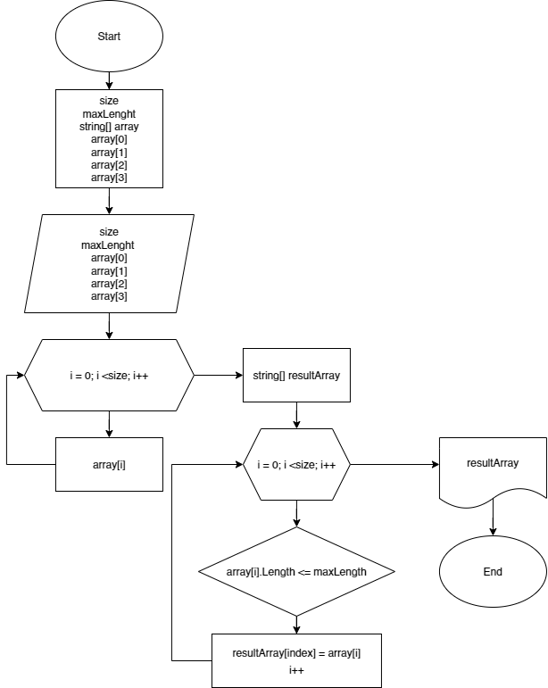

## Описание решения ##

1. Создаем переменную **size** и пустой **массив**.
2. Определяем максимальную длину элемента в массиве (**maxLenght**).
3. Задаем каждый элемент массива.
4. С помощью метода **PrintArray(array)** считываем каждую позицию в массиве и выводим её в терминале.
5. Применяем метод **FillResultArray(string[] resultArray)** для формирования результирующего массива: 
+ создаем цикл ***for*** ;
+ проверяем, отвечает ли определенный элемент массива поставленному условию (array[i].Length <= maxLength);
+ в случае, если условие выполняется, то мы записываем элемент под определенным индексом в результирующий массив (resultArray[i] = array[i]);
+ таким образом проверяем каждый элемент массива путем перебора (***i++***);

6.  После выхода из цикла, необходимо перезаписать массив и вывести результат в терминале. Для этого используем метод **PrintResultArray**:

+ создаем цикл ***for*** ;
+ бепроверяем, отвечает ли определенный элемент массива поставленному условию (array[i].Length <= maxLength);
+ в случае соответствия, выводим этот элемент в новый массив.

 7. После запуска в терминале должно отобразиться 2 массива: один- сформированный пользователем, воторой- отсортированный в соответствии с поставленной задачей. 

## Блок-схема ##

